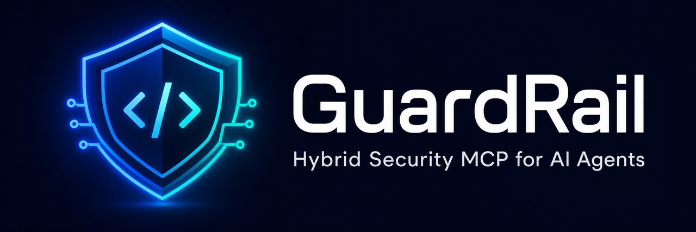

# GuardRail MCP

[](https://github.com/SECRET4422/guardrail-mcp/releases)
[](LICENSE)
[](docs/test-results.md)
[](https://mcpize.com/mcp/guardrail)
[](https://secret4422.github.io/guardrail-mcp/)
[](https://github.com/SECRET4422/guardrail-mcp)

**Hybrid multi-language security MCP for AI coding agents** — secrets, multi-hop taint, tree-sitter, repo/PR scanning, OSV CVEs, SARIF/SBOM, Docker/K8s checks, enterprise policy packs.

> ⭐ **If GuardRail helps you, please [star this repo](https://github.com/SECRET4422/guardrail-mcp)** and leave a review on [MCPize](https://mcpize.com/mcp/guardrail). Stars unlock marketplace trust.

<p align="center">
  
</p>

## Links

| | |
|--|--|
| **Website + live demo** | https://secret4422.github.io/guardrail-mcp/ |
| **MCPize listing** | https://mcpize.com/mcp/guardrail |
| **Release** | https://github.com/SECRET4422/guardrail-mcp/releases/tag/v2.1.0 |
| **Enterprise guide** | [docs/ENTERPRISE.md](docs/ENTERPRISE.md) |
| **Security / threat model** | [docs/SECURITY_MODEL.md](docs/SECURITY_MODEL.md) |
| **Examples** | [docs/EXAMPLES.md](docs/EXAMPLES.md) |
| **Performance** | [docs/PERFORMANCE.md](docs/PERFORMANCE.md) |
| **Test results** | [docs/test-results.md](docs/test-results.md) |
| **Demo video script** | [docs/DEMO_SCRIPT.md](docs/DEMO_SCRIPT.md) |
| **MCPize verified checklist** | [docs/MCPIZE_VERIFIED.md](docs/MCPIZE_VERIFIED.md) |
| **Distribution** | [docs/DISTRIBUTION.md](docs/DISTRIBUTION.md) |

## Why GuardRail?

AI agents generate code **fast**. They also generate:

- hardcoded secrets  
- SQL/command injection patterns  
- `eval` / `shell=True` / pickle foot-guns  
- risky Docker/K8s/Terraform snippets  

GuardRail is an **MCP tool server** agents call *before* applying patches — returning **redacted** findings, remediations, SARIF/SBOM, and policy **ALLOW/DENY**.

## Quick start

```bash
git clone https://github.com/SECRET4422/guardrail-mcp.git
cd guardrail-mcp
pip install -r requirements.txt
export PYTHONPATH=$PWD

# tests
python -m unittest discover -s tests -v

# MCP (Cursor / Claude Desktop)
python -m guardrail --mode stdio

# one-shot hybrid scan
python - <<'PY'
from guardrail.hybrid_scan import hybrid_scan
from pathlib import Path
import json
print(json.dumps(hybrid_scan(Path('examples/vulnerable_sample.py').read_text(), filename='vulnerable_sample.py'), indent=2)[:1500])
PY
```

### Cursor / Claude `mcp.json`

```json
{
  "mcpServers": {
    "guardrail": {
      "command": "python",
      "args": ["-m", "guardrail", "--mode", "stdio"],
      "cwd": "/absolute/path/to/guardrail-mcp",
      "env": { "PYTHONPATH": "/absolute/path/to/guardrail-mcp" }
    }
  }
}
```

## Feature map

| Capability | Status |
|------------|--------|
| Multi-language hybrid scan | Shipped |
| Python AST + multi-hop taint | Shipped |
| Tree-sitter structural sinks | Shipped |
| Repo / git-diff parallel scan + cache | Shipped |
| OSV dependency CVEs | Shipped |
| SARIF 2.1 + CycloneDX/SPDX SBOM | Shipped |
| Docker/K8s/IaC heuristics | Shipped |
| Custom rules + plugins | Shipped |
| Enterprise RBAC / policy / audit | Shipped |
| Marketing site + playground demo | Shipped |
| Automated tests (65) | Shipped |

## Performance (snippet class)

| Workload | Mean latency |
|----------|--------------|
| Dirty Python sample | ~9 ms |
| Clean Python | ~0.7 ms |
| Small JS | ~0.5 ms |

Details: [docs/PERFORMANCE.md](docs/PERFORMANCE.md) · raw JSON in `benchmarks/`.

## Security model

Static analysis only — **does not execute** scanned code. Secrets are **redacted** in findings. See the full threat model: [docs/SECURITY_MODEL.md](docs/SECURITY_MODEL.md).

## Pricing (MCPize)

| Plan | Price |
|------|-------|
| Free (self-host) | $0 |
| Pro | $29/mo |
| Team | $99/mo |
| Enterprise | $299/mo |

Listing: https://mcpize.com/mcp/guardrail  

## Brand assets

Logos, favicons, OG image, MCPize banner: [`assets/`](assets/) and optimized [`assets/web/`](assets/web/).

## Contributing & stars

- Read [CONTRIBUTING.md](CONTRIBUTING.md)  
- Please **star** the repo if you use GuardRail  
- Leave an MCPize review after trying the hosted listing  
- Record a short demo with [docs/DEMO_SCRIPT.md](docs/DEMO_SCRIPT.md)

## License

MIT — see [LICENSE](LICENSE).
